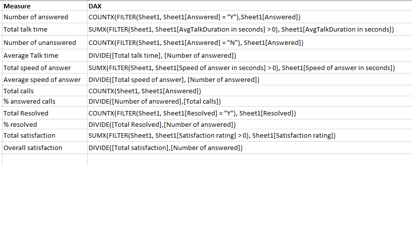
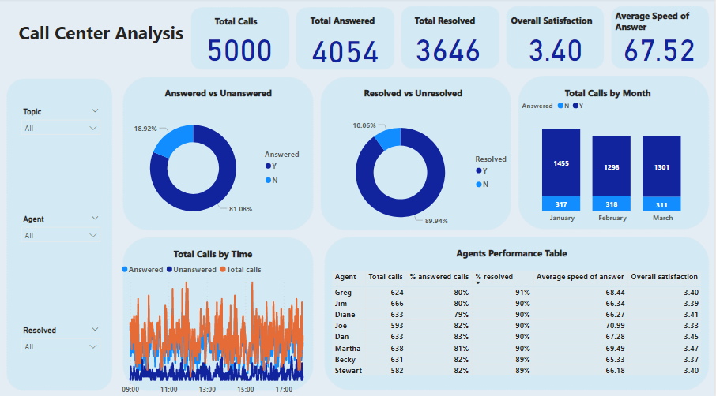

# Call-Centre-Trend-Analysis

## Introduction
**Chiama** is a telecom company who wants to get transparency and insight into the data at their call centre. Seeking an accurate overview of long term trends in customer and agent behaviour.

**_Disclaimer_**: _All datasets and report do not represent any company or organisation but just a dummy dataset to demonstrate capability of Power BI_

## Power BI Reporting Requirement
1.	Define proper KPI
2.	Create a dashboard reflecting an overview of the trends in customer and agent behaviour
3.	Explain findings from the analysis
#### KPI defined in this report are:
1.	Total calls
2.	Total calls answered
3.	Total calls resolved
4.	Overall satisfaction
5.	Average Speed of answer
6.  Answered vs Unanswered calls
7.  Resolved vs Unresolved calls
8.  Total calls by month
9.  Total calls by time
11. Agents performance table
   
## Skills Demonstrated
- Problem understanding 
- Problem solving 
- Critical thinking
- Data cleaning
- Data manipulation
- Template design
- Data analysis
- Visualisation
- DAX 
- Written communication
- Data Analysis
- Documentation

## Data Sourcing
The dataset was provided in an excel workbook.

## Data Description
To show an understanding of the dataset, the data description is shown below:

## Mockup draft
Based on the report requirements, a draft of the report was thoughtful created (_shown below_) as a guide in the course of building the report.

## ETL
Power BI desktop was launched and connected to Excel workshop as that is the format of the dataset. Lots of transformation process was carried out such:
-  Checked all the tables, rows and columns to ensure consistent formatting, no missing values and duplicate values. 
- Used first row as header
- Replaced null values with 0 in AvgTalk and satisfaction columns as they represent calls that were unanswered 
- Created custom column to have the call duration in seconds and removed the initial call duration column (AvgTalkDuration)
After these, I closed and applied settings to start analysis

## DAX measures calculations
The following measures were calculated to aid my analysis.

## Dashboard Design
The background of the dashboard was designed in power point with the mock up draft as a guide. It was saved as PNG file and imported in Power BI.

### Analysis and Visualization
Using the mockup draft and following the report requirements, I built the dashboard as required.

The interactive dashboard can be accessed [here]( https://app.powerbi.com/view?r=eyJrIjoiNGM3M2FjMTAtMDM2ZC00MDFiLTg0MTktMjZhNGVkNGE5ZWNmIiwidCI6ImFmMWJhNzExLTA2MmMtNGYzZS04YmNjLWQyY2U4N2RjNGQwYSJ9)

### Interpretation
-	Approximately 81% of the calls are answered and 90% are resolved
-	January experienced the highest number of calls as well as resolved calls
-	11am – 15:30 appears to be the peak period for calls
-	Overall satisfaction is 3.40 and three agents fell below this rating
-	Average speed of answer is 67.52 and more than half of the agents fell below the average
-	Only two agents are above the average percentage of resolved calls
-	Only one agent fell below the average percentage of answered calls

Further insights can be gotten by using the filtering the visuals by topic, agents and resolved.
